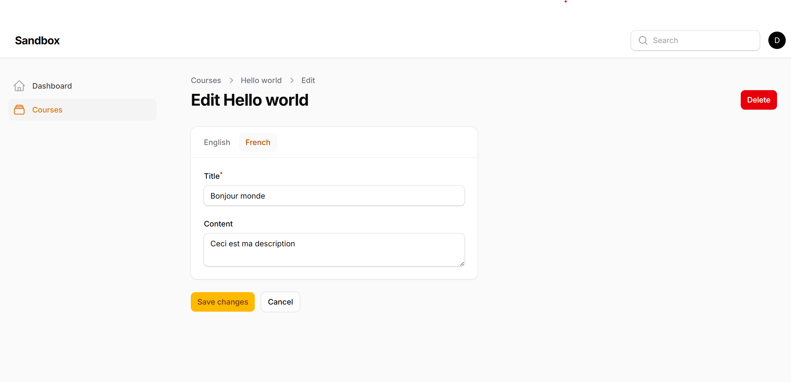
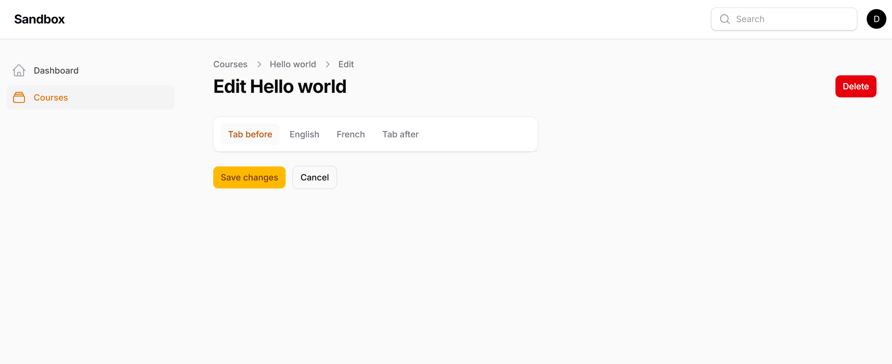
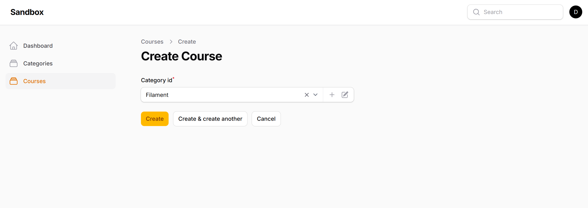
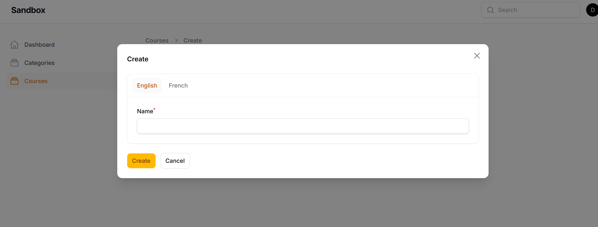

# Filament Astrotomic

[](https://packagist.org/packages/Doriiaan/filament-astrotomic)
[](https://packagist.org/packages/Doriiaan/filament-astrotomic)

This package is an extension for [Filament](https://filamentphp.com) and [laravel-translatable](https://docs.astrotomic.info/laravel-translatable).

> This package is a copy of [cactus-galaxy/filament-astrotomic](https://github.com/CactusGalaxy/FilamentAstrotomic) for Filament 4. The original package is no longer maintained.


## Installation

You can install the package via Composer:

```bash
composer require doriiaan/filament-astrotomic
```

Publish configs for [`astrotomic/laravel-translatable`](https://docs.astrotomic.info/laravel-translatable/installation#configuration) package:

```bash
php artisan vendor:publish --tag="translatable"
```

After this, you will have to configure the locales your app should use.

```php
'locales' => [
    'uk',
    'en',
],
```

## Adding the plugin to a panel

To add a plugin to a panel, you must include it in the configuration file using the `plugins()` method:

```php
use Doriiaan\FilamentAstrotomic\FilamentAstrotomicPlugin;

public function panel(Panel $panel): Panel
{
    return $panel
        // ...
        ->plugins([
            FilamentAstrotomicPlugin::make(),
        ]);
}
```

## Preparing your model class

You need to make your model translatable. You can read how to do this in [documentation for Laravel translatable](https://docs.astrotomic.info/laravel-translatable/installation#models).

## Preparing your resource class

You must apply the `ResourceTranslatable` trait to your resource class:

```php
use Doriiaan\FilamentAstrotomic\Resources\Concerns\ResourceTranslatable;
use Filament\Resources\Resource;

class CourseResource extends Resource
{
    use ResourceTranslatable;

    // ...
}
```

## Making resource pages translatable

After [preparing your resource class](#preparing-your-resource-class), you must make each of your resource's pages translatable too.
You can find your resource's pages in the `Pages` directory of each resource folder.
To prepare a page, you must apply the corresponding `{Type}Translatable` trait to it:

```php
use Doriiaan\FilamentAstrotomic\Resources\Pages\ListTranslatable;
use Filament\Resources\Pages\ListRecords;

class ListProducts extends ListRecords
{
    use ListTranslatable;

    // ...
}
```

```php
use Doriiaan\FilamentAstrotomic\Resources\Pages\CreateTranslatable;
use Filament\Resources\Pages\CreateRecord;

class CreateProduct extends CreateRecord
{
    use CreateTranslatable;

    // ...
}
```

```php
use Doriiaan\FilamentAstrotomic\Resources\Pages\EditTranslatable;
use Filament\Resources\Pages\EditRecord;

class EditProduct extends EditRecord
{
    use EditTranslatable;

    // ...
}
```

And if you have a `ViewRecord` page for your resource:

```php
use Doriiaan\FilamentAstrotomic\Resources\Pages\ViewTranslatable;
use Filament\Resources\Pages\ViewRecord;

class ViewProduct extends ViewRecord
{
    use ViewTranslatable;

    // ...
}
```

### Setting the translatable locales for a particular resource

By default, the translatable locales loaded using [Astrotomic's Locales helper from method `all()`](https://docs.astrotomic.info/laravel-translatable/package/locales-helper#all)
which returns all locales from the `translatable.locales` configuration.
Alternatively, you can customize the translatable locales for a particular resource by overriding the `getTranslatableLocales()` method in your resource class:

```php
use CactusGalaxy\FilamentAstrotomic\Resources\Concerns\ResourceTranslatable;
use Filament\Resources\Resource;

class CourseResource extends Resource
{
    use ResourceTranslatable;

    // ...

    public static function getTranslatableLocales(): array
    {
        return ['uk', 'en'];
    }
}
```

## Using locale tabs on the form

`TranslatableTabs` extends the default [`Filament\Schemas\Components\Tabs`](https://filamentphp.com/docs/4.x/schemas/tabs) component and provides a way to create tab schema tabs for each locale.
Within the `localeTabSchema` method, you can define the callback for schema for each tab. 
This callback will be called for each locale to generate scheme for tab. 

To accept the `TranslatableTab` instance as an argument to get the current locale you need to name argument as `$translatableTab` or use type hint, like in example bellow.

Here is an example of how to use `TranslatableTabs` in the `CourseResource` form:

```php
<?php

namespace App\Filament\Admin\Resources\Courses\Schemas;

use Doriiaan\FilamentAstrotomic\Schemas\Components\TranslatableTabs;
use Doriiaan\FilamentAstrotomic\TranslatableTab;
use Filament\Forms\Components\Textarea;
use Filament\Forms\Components\TextInput;
use Filament\Schemas\Schema;

class CourseForm
{
    public static function configure(Schema $schema): Schema
    {
        return $schema
            ->components([
                TranslatableTabs::make()
                    ->localeTabSchema(fn (TranslatableTab $tab) => [
                        TextInput::make($tab->makeName('title'))
                            ->required(),
                        Textarea::make($tab->makeName('content'))
                            ->required($tab->isMainLocale())
                    ])
            ]);
    }
}
```



With this code, you will get tabs for each locale with `name` field in each tab. `name` field will be **required** only for the **main locale**.

By default `$tab->makeName('name')` uses array syntax for naming -`{$locale}.{$name}`, but you can change it by calling `makeNameUsing` on `TranslatableTabs`, for example, use [plain syntax](https://docs.astrotomic.info/laravel-translatable/usage/forms#request-as-plain-syntax):

```php
TranslatableTabs::make()
    // plain syntax
    ->makeNameUsing(fn (string $name, string $locale) => "{$name}:{$locale}")
    // or use an alias
    ->makeNameUsingPlainSyntax()
    // ..
```

### Prepend or append tabs

Sometimes you need to add tabs before or after the localized tabs. You can use the `prependTabs` and `appendTabs` methods for this:

```php
use Filament\Schemas\Components\Tabs\Tab;

TranslatableTabs::make()
    ->localeTabSchema(fn (TranslatableTab $tab) => [
        TextInput::make($tab->makeName('title'))
            ->required(),
        Textarea::make($tab->makeName('content'))
            ->required($tab->isMainLocale())
    ])
    ->prependTabs([
        Tab::make('Tab before')
    ])
    ->appendTabs(fn () => [
        Tab::make('Tab after')
            ->schema([
                // ...
            ])
        // ...
    ])
```



## Processing modal forms with translations

If you want to use translations in modal forms, you need to make some changes, to correctly mutate and fill your form.

### Edit table action

For example, we have `CourseResource` but don't have an edit page.

To process translations in the Edit action modal, you need to override the `mutateRecordDataUsing` method of the `EditAction` class in the resource class.

And if you are using a Column with path `translation.*`, make sure to unset the `translation` relation from the record data before returning it, otherwise, the record data will be saved incorrectly.

```php
use App\Filament\Admin\Resources\Courses\CourseResource;
use App\Models\Course;
use Filament\Actions\BulkActionGroup;
use Filament\Actions\DeleteBulkAction;
use Filament\Actions\EditAction;
use Filament\Tables\Columns\TextColumn;
use Filament\Tables\Table;

class CoursesTable
{
    public static function configure(Table $table): Table
    {
        return $table
            ->columns([
                TextColumn::make('translation.title'),
            ])
            ->filters([
                //
            ])
            ->recordActions([
                EditAction::make()->mutateRecordDataUsing(function (Course $record, array $data) {
                    return CourseResource::mutateTranslatableData($record, $data);
                })->mutateDataUsing(function (Course $record, array $data) {
                    $record->unsetRelation('translation');

                    return $data;
                }),
            ])
            ->toolbarActions([
                BulkActionGroup::make([
                    DeleteBulkAction::make(),
                ]),
            ]);
    }
}
```

### Select with modal options

There is a more complex example with `Select` component.
For example, we need to manage (create or edit) a category for the product.

In the `CategoryResource` defined form with translatable fields.

```php
namespace App\Filament\Admin\Resources\Categories\Schemas;

use Doriiaan\FilamentAstrotomic\Schemas\Components\TranslatableTabs;
use Doriiaan\FilamentAstrotomic\TranslatableTab;
use Filament\Forms\Components\TextInput;
use Filament\Schemas\Schema;

class CategoryForm
{
    public static function configure(Schema $schema): Schema
    {
        return $schema
            ->components([
                TranslatableTabs::make()
                    ->localeTabSchema(fn (TranslatableTab $tab) => [
                        TextInput::make($tab->makeName('name'))
                            ->required($tab->isMainLocale())
                            ->maxLength(255),
                    ]),
            ]);
    }
}
```

Then in `CourseResource` we can use `Select` component with modal options. Note that we need to call the `fillEditOptionActionFormUsing` method and mutate record data 

```php
namespace App\Filament\Admin\Resources\Courses\Schemas;

use App\Filament\Admin\Resources\Categories\CategoryResource;
use App\Filament\Admin\Resources\Categories\Schemas\CategoryForm;
use App\Models\Category;
use Filament\Forms\Components\Select;
use Filament\Schemas\Schema;

class CourseForm
{
    public static function configure(Schema $schema): Schema
    {
        return $schema
            ->components([
                Select::make('category_id')
                    ->required()
                    ->native(false)
                    ->searchable()
                    ->options(
                        Category::all()->pluck('name', 'id')
                    )
                    // Configure create action - https://filamentphp.com/docs/4.x/forms/select#creating-a-new-option-in-a-modal
                    ->createOptionModalHeading('Create')
                    ->createOptionForm(fn (Schema $schema) => CategoryForm::configure($schema))
                    ->createOptionUsing(function (array $data) {
                        $optionRecord = Category::create($data);

                        return $optionRecord->id;
                    })
                    // Configure edit action - https://filamentphp.com/docs/4.x/forms/select#editing-the-selected-option-in-a-modal
                    ->editOptionModalHeading('Edit')
                    ->editOptionForm(fn (Schema $schema) => CategoryForm::configure($schema))
                    ->fillEditOptionActionFormUsing(function (string $state) {
                        if (!$state) {
                            return [];
                        }

                        $optionRecord = Category::find($state);

                        return CategoryResource::mutateTranslatableData($optionRecord, $optionRecord->attributesToArray());
                    })
                    ->updateOptionUsing(function (array $data, string $state) {
                        $optionRecord = Category::find($state);

                        $optionRecord->update($data);

                        return $optionRecord->id;
                    })
            ]);
    }
}
```





## Columns for translatable models on listings

Out of the box, Filament supports nesting for columns, which means you can use `.` in the column path to access nested properties, and you don't need a special column for translatable models.

```php
TextColumn::make('translation.name'),
```

**But** searching by translatable column is a bit more complicated. Simply overload searchable query like this. 

In addition, in Filament 4, Text columns can be arrays. To show only the first translations, use `->limitList(1)`.

```php
<?php

namespace App\Filament\Admin\Resources\Courses\Tables;

use Filament\Actions\BulkActionGroup;
use Filament\Actions\DeleteBulkAction;
use Filament\Actions\EditAction;
use Filament\Tables\Columns\TextColumn;
use Filament\Tables\Table;

class CoursesTable
{
    public static function configure(Table $table): Table
    {
        return $table
            ->columns([
                TextColumn::make('translations.title')
                    ->limitList(1)
                    ->label('Title')
                    ->searchable(query: function ($query, string $search) {
                        $query->whereTranslationLike('title', '%'.$search.'%');
                    }),
            ])
            ->filters([
                //
            ])
            ->recordActions([
                EditAction::make(),
            ])
            ->toolbarActions([
                BulkActionGroup::make([
                    DeleteBulkAction::make(),
                ]),
            ]);
    }
}
```

> Maybe in the feature someone will create a column for that 🙂, but currently you can use this code to configure your columns.

## Testing

```bash
composer test
```

## Changelog

Please see [CHANGELOG](CHANGELOG.md) for more information on what has changed recently.

## Contributing

> Please see [CONTRIBUTING](.github/CONTRIBUTING.md) for details.

## Security Vulnerabilities

Please review [our security policy](../../security/policy) on how to report security vulnerabilities.

## Credits

- [Alary Dorian](https://github.com/Doriiaan)
- [Oleksandr Moik](https://github.com/oleksandr-moik)
- [All Contributors](../../contributors)

## License

The MIT License (MIT). Please see [License File](LICENSE.md) for more information.
